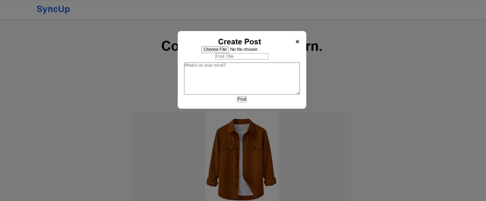

# SyncUp

SyncUp is a simple community discussion platform where users can create and share posts with a title, description, and image.

## Features

- Create community posts
- Add a title to posts
- Add a description to posts
- Upload images with posts
- View posts on the community feed
- Store post data in MongoDB

## Tech Stack

### Frontend
- HTML
- CSS
- JavaScript

### Backend
- Node.js
- Express.js

### Database
- MongoDB
- Mongoose

### File Uploads
- Multer

## Screenshots

### Home Page




## Installation

1. Clone the repository

```bash
git clone https://github.com/YOUR_USERNAME/community-discussion-platform.git
```

2. Navigate to the project folder

```bash
cd community-discussion-platform
```

3. Install dependencies

```bash
npm install
```

4. Configure your MongoDB connection string

5. Start the server

```bash
node server.js
```

6. Open your browser

```text
http://localhost:3000
```

## Future Improvements

- User authentication
- User profiles
- Comments on posts
- Likes and reactions
- Search functionality
- Real-time notifications

## Author

Developed by Blaze
